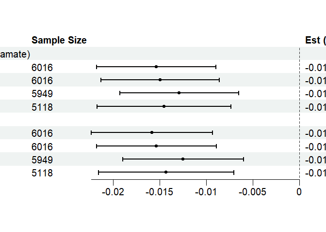

``` r
library(tidyverse)
library(readxl)
library(grid)
library(forestploter)
library(gridExtra)
```

# Figure 2

``` r
reped_chem <- c("chem_100000010", "chem_100001083")
```

## Read results data

``` r
raw_tab <- read.csv("Results/20240403_Seondary_Results_CombinedBatch_updated_V4.csv")
```

## Add CI

``` r
raw_tab$CI_Lower <- raw_tab$Est - 1.96 * raw_tab$SE
raw_tab$CI_Upper <- raw_tab$Est + 1.96 * raw_tab$SE
```

## Subset to WHIIRS

``` r
sub_tab <- raw_tab %>%
  separate(col = Model, into = c("Exposure", "Model_new"), sep = "_comb_", remove = FALSE)

sub_tab <- subset(sub_tab, select = -Model)
colnames(sub_tab)[colnames(sub_tab) == "Model_new"] <- "Model"

sub_tab <- sub_tab[sub_tab$Exposure == "WHIIRS", ]
```

## process table

``` r
sub_tab <- subset(sub_tab, select = c(
  "CHEMICAL_NAME", "Model", "n", "Est", "SE",
  "pval", "CI_Lower", "CI_Upper"
))
sub_tab <- sub_tab[order(sub_tab$CHEMICAL_NAME), ]

sub_tab <- sub_tab %>%
  split(.$CHEMICAL_NAME) %>%
  purrr::map(~ add_row(., CHEMICAL_NAME = unique(.$CHEMICAL_NAME))) %>%
  bind_rows()

sub_tab <- sub_tab %>% add_row(CHEMICAL_NAME = "3-phenylpropionate (hydrocinnamate)", .before = 1)

sub_tab[6, 1] <- sub_tab[7, 1]

sub_tab <- sub_tab[-nrow(sub_tab), ]

sub_tab$CHEMICAL_NAME <- ifelse(is.na(sub_tab$Model),
  sub_tab$CHEMICAL_NAME,
  paste0("        ", sub_tab$Model)
)
colnames(sub_tab)[1] <- "Metabolite & Model"

sub_tab <- subset(sub_tab, select = -Model)


sub_tab$n <- ifelse(is.na(sub_tab$n), "", sub_tab$n)

sub_tab$` ` <- paste(rep("      ", 10), collapse = " ")

sub_tab$`Est (95% CI)` <- ifelse(is.na(sub_tab$Est), "",
  paste0(sprintf(
    "%.3f (%.3f to %.3f)",
    sub_tab$Est, sub_tab$CI_Lower, sub_tab$CI_Upper
  ), " ")
)

sub_tab$pval <- formatC(sub_tab$pval, format = "e", digits = 2)

sub_tab$`P-Value` <- ifelse(is.na(sub_tab$Est), "", sub_tab$pval)

colnames(sub_tab)[2] <- "Sample Size"
```

## Plot

``` r
tm <- forest_theme(
  base_size = 15,
  # Confidence interval point shape, line type/color/width
  ci_pch = 19,
  ci_col = c("black"),
  ci_fill = "black",
  ci_alpha = 1,
  ci_lty = 1,
  ci_lwd = 2,
  ci_Theight = 0.3, # Set a T end at the end of CI
  # Reference line width/type/color
  refline_lwd = gpar(lwd = 1, lty = "dashed", col = "grey20"),
  # Vertical line width/type/color
  vertline_lwd = 1,
  vertline_lty = "dashed",
  vertline_col = "grey20",
  # Change summary color for filling and borders
  summary_fill = "#4575b4",
  summary_col = "#4575b4",
  # Footnote font size/face/color
  footnote_gp = gpar(cex = 0.6, fontface = "italic", col = "blue")
)
```

    ## refline_lwd will be deprecated, use refline_gp instead.

    ## Warning in numnotnull("lwd"): NAs introduced by coercion

    ## Warning in numnotnull("lwd"): NAs introduced by coercion

``` r
p <- forest(sub_tab[, c(1, 2, 8:10)],
  est = sub_tab$Est,
  lower = sub_tab$CI_Lower,
  upper = sub_tab$CI_Upper,
  sizes = 0.5,
  ci_column = 3,
  ref_line = 0,
  theme = tm
)
print(p)
```



# Figure 3

## Read results data

``` r
m1_dat <- readRDS("Results/20240312_MRS_forPlot_M1_Ranked.RDS")
m1_nomed_dat <- readRDS("Results/20240312_MRS_forPlot_M1_nomed_Ranked.RDS")
```

## Process data

``` r
m1_dat$Model <- "M1"
m1_nomed_dat$Model <- "M1_No_Med"
sum_dat <- rbind(m1_dat, m1_nomed_dat)
sum_dat$Exposures <- as.factor(sum_dat$Exposures)
new_order <- c(
  "Insomnia", "WHIIRS", "SLEA4", "SLEA5", "SLEA6", "SLEA7",
  "Insomnia1", "WHIIRS1", "SLEA41", "SLEA51", "SLEA61", "SLEA71"
)
sum_dat$Exposures <- factor(sum_dat$Exposures, levels = new_order)
sum_dat$MODEL <- ifelse(sum_dat$Exposures == "Insomnia" & sum_dat$Model == "M1", "M1_OR",
  ifelse(sum_dat$Exposures == "Insomnia" & sum_dat$Model == "M1_No_Med", "M1_No_Med_OR",
    ifelse(sum_dat$Exposures != "Insomnia" & sum_dat$Model == "M1", "M1_Est", "M1_No_Med_Est")
  )
)
model_order <- c("M1_Est", "M1_No_Med_Est", "M1_OR", "M1_No_Med_OR")
sum_dat$MODEL <- factor(sum_dat$MODEL, levels = model_order)
```

## seperate table

``` r
tab_1 <- sum_dat[sum_dat$Exposures == "Insomnia", ]
tab_2 <- sum_dat[sum_dat$Exposures != "Insomnia", ]
```

## Plot 1

``` r
my_colors <- c("darkblue", "lightblue")

p1 <- ggplot(tab_1, aes(x = Exposures, y = Est, color = MODEL)) +
  geom_errorbar(aes(ymin = CI_Lower, ymax = CI_Upper), position = position_dodge(0.7), width = 0.2, linewidth = 1.5) +
  geom_point(position = position_dodge(0.7), size = 3) +
  geom_text(aes(label = Metabolites), hjust = -0.2, vjust = -0.3, size = 7, position = position_dodge(0.7)) +
  scale_color_manual(values = my_colors) +
  theme_bw(base_size = 20) +
  ylab("Odds Ratio") +
  theme(plot.caption = element_text(hjust = 0.5, size = 22)) +
  theme(legend.position = "none") +
  theme(axis.title.x = element_blank()) +
  geom_hline(aes(yintercept = 1), color = "red", linetype = "dashed", linewidth = 1.5)
```

## Plot 2

``` r
my_colors <- c("darkblue", "lightblue")

p2 <- ggplot(tab_2, aes(x = Exposures, y = Est, color = Model)) +
  geom_errorbar(aes(ymin = CI_Lower, ymax = CI_Upper), position = position_dodge(0.7), width = 0.2, linewidth = 1.5) +
  geom_point(position = position_dodge(0.7), size = 3) +
  geom_text(aes(label = Metabolites), hjust = -0.2, vjust = -0.3, size = 7, position = position_dodge(0.7)) +
  scale_color_manual(values = my_colors) +
  theme_bw(base_size = 20) +
  ylab("Estimate") +
  theme(plot.caption = element_text(hjust = 0.5, size = 22)) +
  theme(legend.position = "bottom") +
  theme(axis.title.x = element_blank()) +
  geom_hline(aes(yintercept = 0), color = "red", linetype = "dashed", linewidth = 1.5)
```

## Combine two plots

``` r
grid.arrange(p1, p2, ncol = 1)
```


